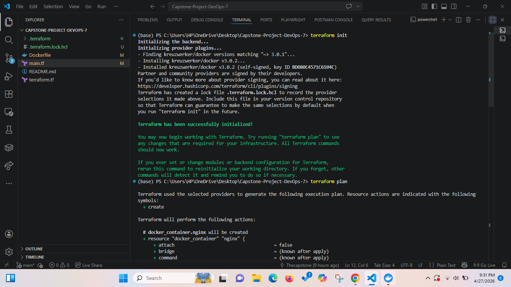
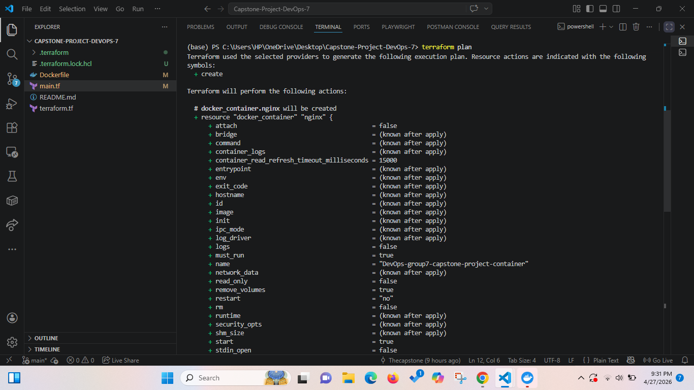
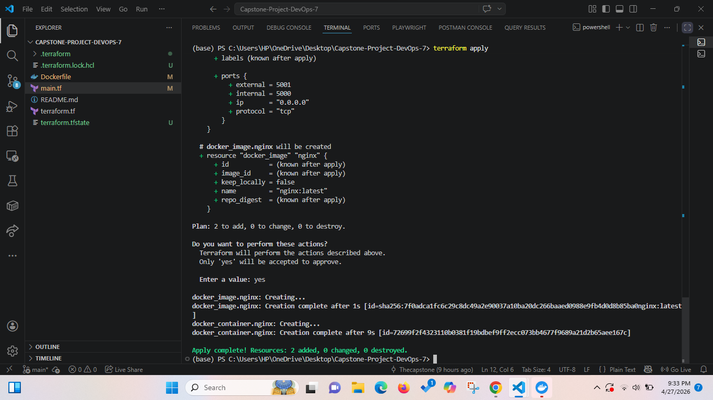
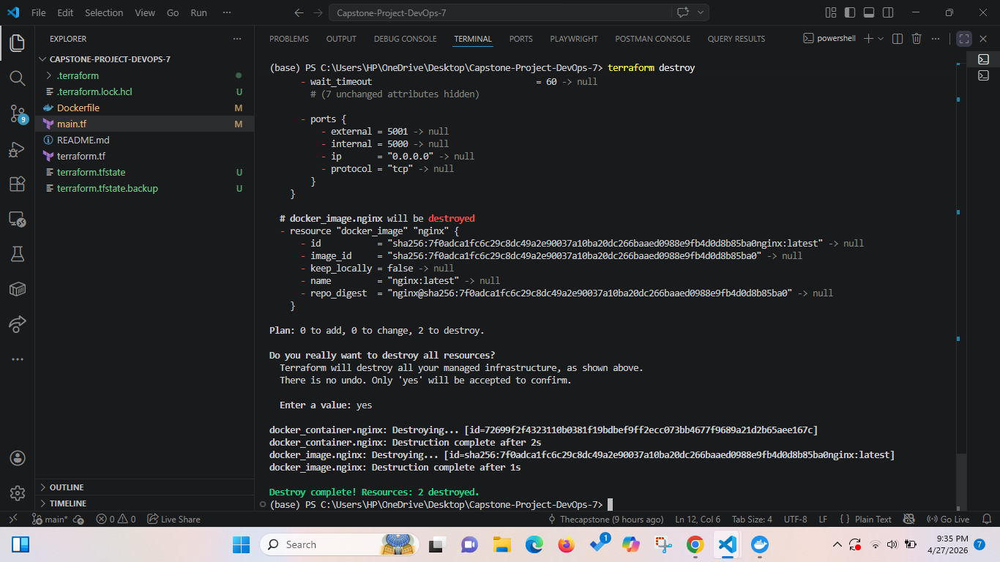
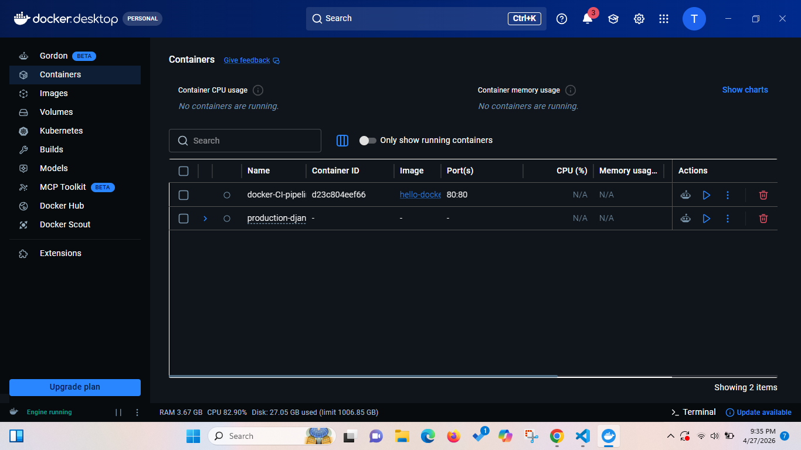

# DevOps Capstone Project: Group 7
## Project: Provisioning and Managing Local Docker Container, using Terraform.
- [x] Provisioned Docker container using Terraform
- [x] Defined container and provider parameters in main.tf and terraform.tf respectively
- [x] Initialized Terraform:
- [x] Ran Terraform init  
  

- [x] Ran Terraform plan to inspect the resources set to be provisioned  
  

- [x] Ran Terraform apply to apply all changes  
  

- [x] Confirmed container creation in Docker Desktop  
  

- [x] Ran Terraform destroy to clean up resources  
  

- [x] Confirmed removal of Docker container in Docker Desktop  
  
## Final Observations

- Terraform made the provisioning and managing of a Docker container much easier, 
- Provided the ability to see the proposed changes how they are to be applied,
- And simplified the ability to delete the Docker container and image.